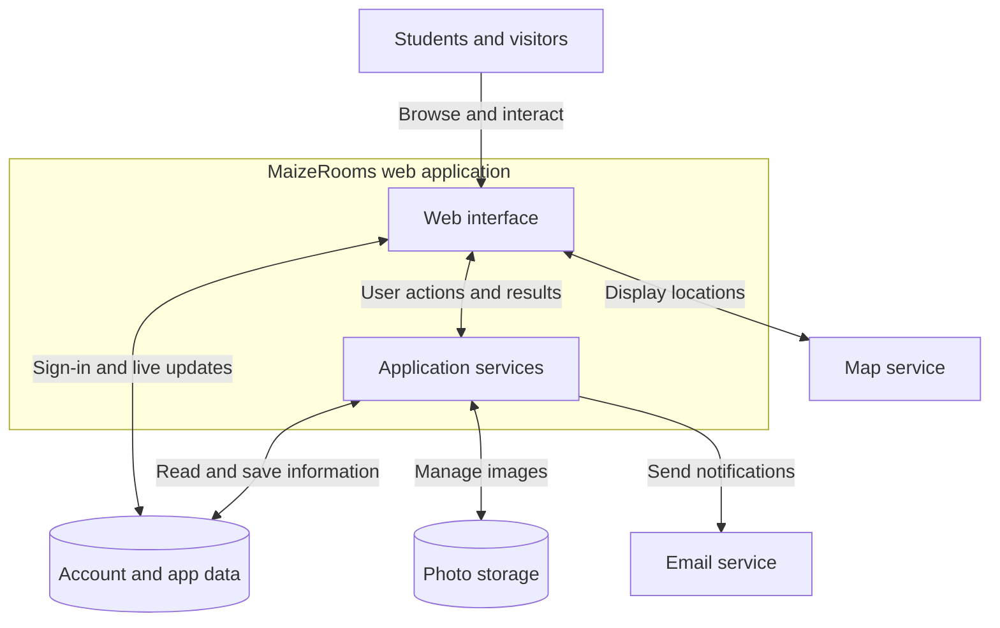

<p align="left">
  
</p>

# MaizeRooms

**Find a sublease. Fill your space. Stay connected to campus.**

MaizeRooms is a sublease marketplace for University of Michigan students. It brings listings, availability, photos, and conversations into one place, helping students find housing that fits their schedule or connect with someone interested in their space.

**[Visit MaizeRooms](https://maizerooms.com/)** · **[Get support](https://maizerooms.com/support)**

## Table of contents

- [Quickstart](#quickstart)
- [Features](#features)
- [Architecture](#architecture)
- [Usage examples](#usage-examples)
- [Local development](#local-development)
- [FAQ](#faq)
- [Support](#support)

## Quickstart

No installation is required to use the website.

1. Open [MaizeRooms](https://maizerooms.com/) and browse listings.
2. Set your budget, dates, and room preferences. Open a listing to review its photos, rent, and availability.
3. Create an account with your `@umich.edu` email and confirm your email address to save favorites, message other users, or publish a listing.

To advertise a space, start a new listing and enter its details, availability, and photos. Review the information before publishing.

MaizeRooms supports discovery and communication. Lease agreements and payments are arranged outside the platform.

## Features

| Feature | What it helps you do |
| --- | --- |
| Housing filters | Narrow listings by monthly rent, availability dates, bedrooms, and bathrooms. |
| Listing details and photos | Compare spaces before contacting the person who posted them. |
| Map view | Explore approximate locations alongside listing information. |
| Favorites | Keep a shortlist of places to revisit. |
| In-app messaging | Ask questions and discuss a sublease with another user. |
| Listing creation | Advertise a space with dates, pricing, details, and a photo gallery. |
| Reporting and blocking | Flag a concern for review or stop unwanted contact. |

## Architecture

MaizeRooms uses a Next.js and TypeScript web application with supporting services for accounts, stored data, images, email, and maps. This diagram groups those parts by responsibility.



The web interface presents listings and conversations. Application services handle requests and coordinate changes. Account and data services retain user, listing, and conversation information; photo storage holds uploaded images. Email and maps support notifications and location context.

## Usage examples

### Find a place for your dates

**Scenario:** You need a summer sublease within a monthly budget.

Open the filters, choose a price range and your dates, and apply them. Select a matching listing, browse its photos, and save it to your favorites after signing in.


<!-- > **[TODO] Add GIF 1: finding a sublease.** Record a silent, 12–18 second demo showing filters being applied, the results changing, and a listing opening. Keep the text readable and pause briefly on the final listing. -->

<!-- Replace the TODO above with the completed GIF:

-->

### Build a listing's photo gallery

**Scenario:** You are preparing to advertise your space and want a clear cover photo.

During listing creation, upload photos, crop a photo if needed, and drag the images into your preferred order. Put the most representative image first, then continue through the listing details.

### Asking for support

**Scenario:** Something isn't working how you imagined. It's easy to contact support! 


<!-- > **[TODO] Add GIF 2: preparing listing photos.** Record a silent, 12–18 second demo showing photos being added and reordered, with the cover image changing. Use a demo listing and pause on the finished gallery. -->
    
<!-- Replace the TODO above with the completed GIF:

-->

## Local development

This section is for collaborators who already have source access. Website users can follow the [quickstart](#quickstart).

Since the project is closed-source, this may not be useful to most people.

**Prerequisites:** Node.js 24 with npm, Docker running, and the project's development configuration.

<!-- > **[TODO] Add repository access instructions and a link to the private development setup guide.** The guide should explain how to configure the local services and environment settings needed below. -->

From the web application directory, install dependencies and start the local services:

```bash
npm ci
npx supabase start
```

Complete the local configuration using the development setup guide. With the app configured to use the local database, load sample data and start the web server:

```bash
npm run seed
npm run dev
```

Open [localhost:3000](http://localhost:3000/) in your browser. Photo uploads, email, and maps depend on the development services enabled in your setup.

## FAQ

### Why don't my dates return any listings?

The date filter looks for listings whose availability covers your requested period. A listing that overlaps only part of that period may be excluded. Clear the dates or widen your other filters to explore more options.

### My confirmation link expired. What should I do?

If you already confirmed your email, try signing in. Otherwise, return to sign-up to request a new confirmation link. Check your spam folder if the email does not arrive; contact support if the problem continues.

### Why won't a photo upload or let me continue?

Use JPG, PNG, or WebP files no larger than 10 MB each. A listing needs at least three photos to continue and supports up to 25. Convert unsupported formats or reduce oversized files before trying again.

### Why can't I see an exact street address?

Public listings show approximate locations. Ask the person who posted the listing for any address or viewing details you need before making arrangements.

### What if a listing or message seems suspicious?

Use the report option on the listing or user, and block unwanted contact when appropriate. You can also [contact support](https://maizerooms.com/support) with the relevant details. Email confirmation does not establish property ownership or verify a lease agreement.

## Support

For account, listing, or messaging problems, use the [support page](https://maizerooms.com/support) or email [info@maizerooms.com](mailto:info@maizerooms.com).
